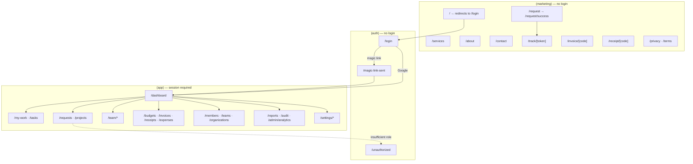
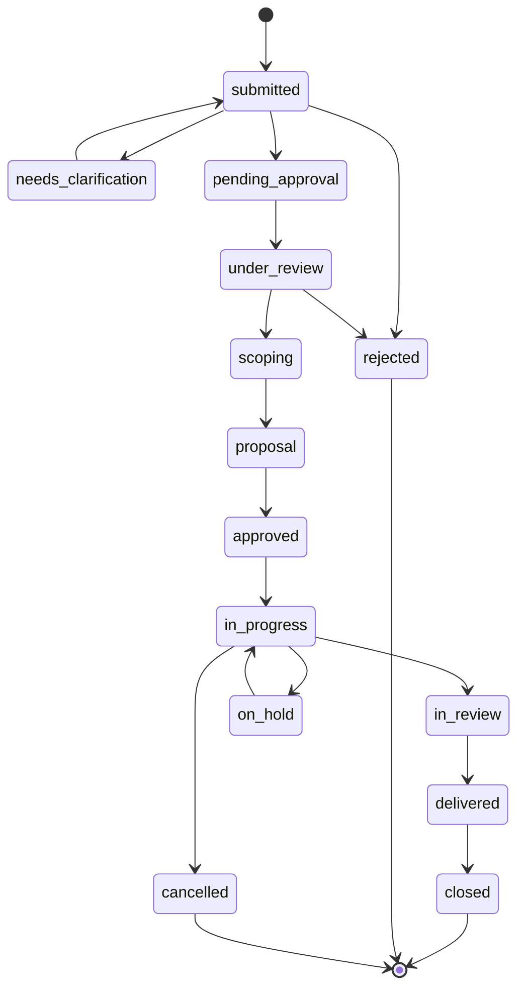
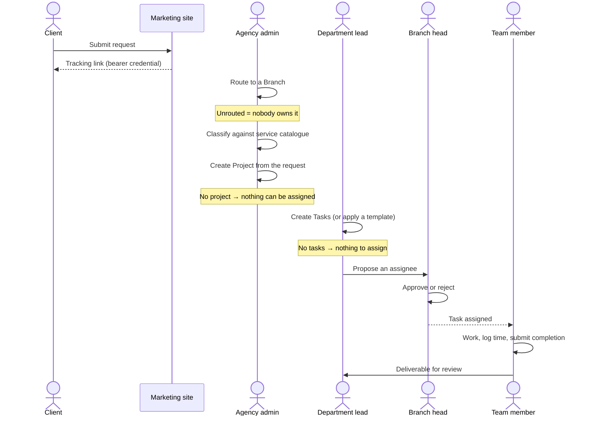
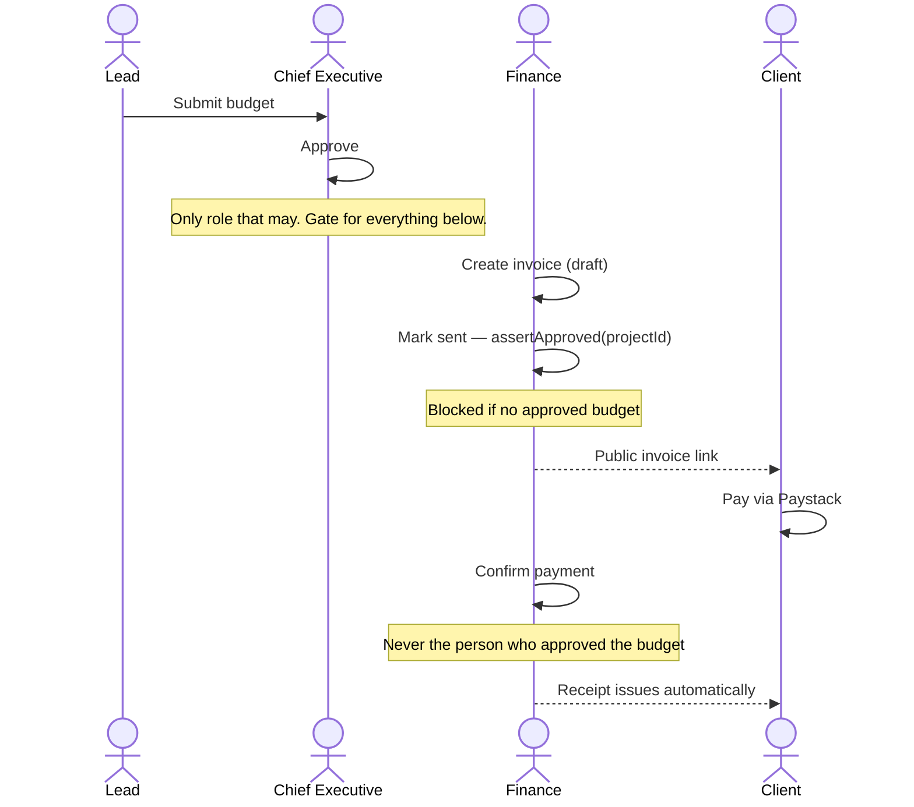
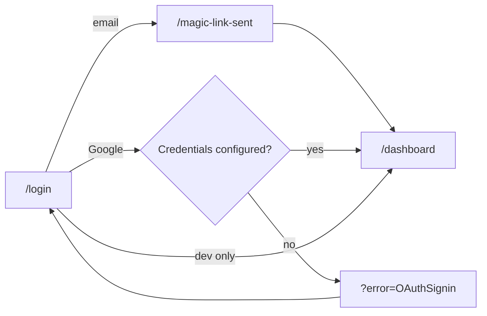
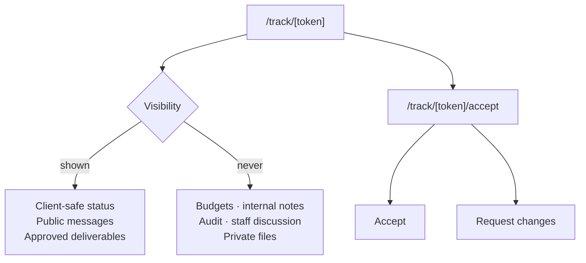

# 03 — App Flow

**Product:** Ethree10 OMS (E310)
**Last updated:** 20 September 2026

Every screen, how they connect, and the flows that matter. Route paths are as they appear in
`app/`.

---

## 1. Navigation map

> **`/` returns 307 to `/login`.** The marketing home page is not reachable at the root in
> production. `/services` and `/about` render the full marketing layout with its footer.

---

## 2. Screen inventory

### Public — `(marketing)`

| Route | Purpose |
|---|---|
| `/services` | Service catalogue, public view |
| `/about` | Agency profile |
| `/contact` | Contact form |
| `/request` → `/request/success` | Public intake; returns a tracking link |
| `/track/[token]` | Client-safe request status. **Token is a bearer credential.** |
| `/track/[token]/accept` | Client accepts a deliverable or requests changes |
| `/invoice/[code]` | Public invoice; pays via `/api/invoices/[code]/pay` |
| `/receipt/[code]` | Public receipt |
| `/privacy` · `/terms` | Legal. Linked from the footer and from `/login`. |

### Auth — `(auth)`

| Route | Purpose |
|---|---|
| `/login` | Magic link + Google. Reads `?error=` and explains failures. Effective home page. |
| `/magic-link-sent` | Confirmation after a magic link is requested |
| `/unauthorized` | Signed in, but the role does not permit the page |

### Application — `(app)`

Sidebar sections are defined in `components/layout/app-sidebar.tsx` with a per-item `allow`
drawn from `role-groups.ts`. Items the role cannot use are not rendered.

**Overview** — everyone
| Route | Purpose |
|---|---|
| `/dashboard` | Role-aware landing |
| `/my-work`, `/tasks`, `/tasks/[id]` | The staff member's own queue and task detail |
| `/my-contributions` | Personal contribution history |
| `/notifications` | In-app notifications |

**Operations**
| Route | Allowed |
|---|---|
| `/inbox` — intake queue | Delivery leads |
| `/requests`, `/requests/[id]`, `/requests/new` | All |
| `/projects`, `/projects/[id]` | All |

**Delivery leadership** — delivery leads
| Route | Purpose |
|---|---|
| `/team/dashboard` | Branch overview with live counts |
| `/team/intake` | Brief review |
| `/team/assignments` | **Approve or reject assignment proposals** |
| `/team/workload` | Capacity across the branch |
| `/team/reviews`, `/team/reviews/[id]` | Review queue |
| `/team/members`, `/team/reports` | Branch people and reporting |

**Money**
| Route | Allowed |
|---|---|
| `/budgets` | Budget approvers |
| `/invoices`, `/invoices/new`, `/invoices/[id]` | Finance |
| `/receipts` | Finance |
| `/expenses` | Finance + delivery leads |
| `/leads` | Agency-wide |

**Agency**
| Route | Allowed |
|---|---|
| `/organizations`, `/organizations/[id]`, `/[id]/requests`, `/[id]/reports` | Agency-wide |
| `/members`, `/members/[id]`, `/members/invite` | Agency-wide + branch heads |
| `/teams` | Agency-wide |
| `/reports`, `/reports/generate`, `/reports/[id]`, `/[id]/edit`, `/[id]/export` | Agency-wide + leads |
| `/admin/analytics`, `/audit` | Agency-wide |

**Administration**
| Route | Allowed |
|---|---|
| `/settings/services` | Branch leads |
| `/settings/skills` | Agency-wide + leads |
| `/settings/templates`, `/routing`, `/review-rules`, `/scorecards`, `/reporting`, `/notifications`, `/security` | Varies |
| `/integrations`, `/admin/cms` | Agency admin |
| `/settings`, `/profile`, `/help` | Everyone |

**Other**
| Route | Purpose |
|---|---|
| `/offline` | Served by the service worker when the network drops |

### API routes

| Route | Purpose |
|---|---|
| `/api/trpc/[trpc]` | All application data |
| `/api/auth/[...nextauth]` | Auth.js |
| `/api/health` | `?mode=live` / `?mode=ready` |
| `/api/csp-report` | CSP violations — public, rate limited, always 204 |
| `/api/files/[...key]` | Attachment serving |
| `/api/invoices/[code]/pay` | Paystack initiation |
| `/api/reports/[id]/pdf` | Report PDF |
| `/api/webhooks/paystack`, `/api/webhooks/plane` | Inbound |
| `/api/cron/reports` | Scheduled report generation |

---

## 3. Key flows

### 3.1 Request lifecycle

Fourteen stages (`RequestStage`):

`delivered`, `closed`, `rejected` and `cancelled` are **settled** — age is no longer a fault.
Everything else is measured against its urgency threshold: critical 1 day, high 3, medium 7,
low 14 (`lib/request-triage.ts`).

### 3.2 Intake to assignment — the chain that matters

> **Assignment is two-step on purpose.** A proposal is not an assignment. Until a branch head
> approves it the task stays unassigned, while looking assigned to whoever proposed it —
> `pnpm ops:report` lists proposals awaiting approval for exactly this reason.

**In production this chain currently stops at Project.** Zero tasks exist. See
[01-PRD §8](01-PRD.md#8-reality-check).

### 3.3 Money

Two invariants, both in `server/services/budget.ts`:

1. **Approval gate** — `BudgetService.assertApproved(projectId)` before any money action.
2. **Separation of duties** — the approver may not confirm the payment; a requester may not
   pay their own expense; nobody holds both `chief_executive` and `finance_manager`.

Receipts are created **only** by `confirmInvoicePayment`. Calling
`ReceiptService.issueForInvoice` from a router is the bypass this design exists to prevent.

### 3.4 Sign-in

On failure Auth.js redirects to `/login?error=…`, which the page reads and turns into
readable copy (`lib/auth-errors.ts`). `Configuration` and `OAuthSignin` say the server is
misconfigured rather than blaming the user.

**Currently `OAuthSignin` in production** — Google credentials are not set.

### 3.5 Client visibility

---

## 4. Offline behaviour

`public/sw.js` registers via `/sw-register.js`, caches the shell, and serves `/offline` on a
failed navigation. The offline page reloads itself when connectivity returns.

---

## Related documents

- [01-PRD.md](01-PRD.md) · [02-TRD.md](02-TRD.md) · [04-UI-UX-Design-Brief.md](04-UI-UX-Design-Brief.md) · [05-Backend-Schema.md](05-Backend-Schema.md) · [06-Implementation-Plan.md](06-Implementation-Plan.md)
- [`user-guides/`](user-guides/) — per-role walkthroughs
