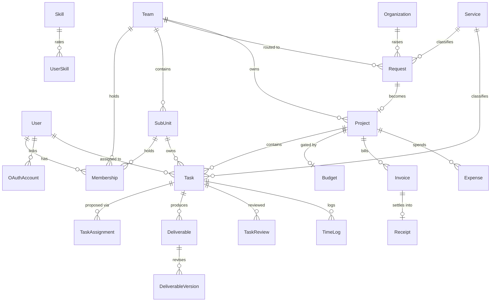

# 05 — Backend Schema and API Surface

**Product:** Ethree10 OMS (E310)
**Source of truth:** `prisma/schema.prisma` (1,428 lines, 51 models, 26 enums)
**Last updated:** 20 September 2026

---

## 1. Naming

| Product term | Prisma model | Lead field |
|---|---|---|
| **Branch** | `Team` | `Team.leadId` → `branch_head` |
| **Department** | `SubUnit` | `SubUnit.leadId` → `department_lead` |
| **Client organisation** | `Organization` | — |

This mapping is the contract. Renaming the models is outstanding work
([02-TRD §7](02-TRD.md#7-technical-debt)).

---

## 2. Core entity relationships

---

## 3. Models by domain

### 3.1 Identity and access

**`User`** — `id` · `email` unique · `emailVerified` · `hashedPassword?` · `name` ·
`avatarUrl?` · `phone?` · `phoneVerifiedAt?` · `phoneVerificationCode?` ·
`phoneVerificationExpiresAt?` · `timezone` (default `Africa/Lagos`) · `workingHoursPerWeek`
(40) · **`isSuperAdmin`** · `mfaEnabled` / `mfaSecret` / `mfaRecoveryCodes` *(unused residue)*
· `deactivatedAt?` · timestamps

**`Membership`** — the join that carries the role.
`userId` · `role` · `teamId?` · `subUnitId?` · `positionId?` · `title?` · `isPrimary` ·
`canManageProjects` · `invitedAt?` · `acceptedAt?` · **`removedAt?`**

> ⚠️ **`@@unique([userId, role, teamId, subUnitId])` does not include `removedAt`.**
> Re-inviting someone to a role they previously held collides on the constraint. Invite
> revives the removed row rather than creating a new one — `tests/integration/member-reactivation.test.ts`
> exists because this locked people out.

**`OAuthAccount`** — `provider` · `providerAccountId` · `accessToken?` · `refreshToken?` ·
`expiresAt?`. Disclosed in `/privacy`.

**`Role`** — `super_admin` · `chief_executive` · `chief_operating_officer` · `agency_admin` ·
`finance_manager` · `branch_head` · `department_lead` · `team_member`

**`Team`** / **`SubUnit`** — `name` · `slug` · `leadId?` · `archivedAt?`
**`Organization`** — `name` · `slug` · `isExternal` · `defaultCurrency` · `archivedAt?`
**`Position`**, **`VerificationToken`**, **`PublicRateLimit`** (`@@id([key, action, windowStart])`)

### 3.2 Capability

`Service` · `Skill` · `SkillLevel` · `ServiceCapability` · `UserSkill` — the vocabulary the
assignee suggester matches against. 27 catalogue rows in production.

### 3.3 Intake and delivery

**`Request`** — `code` unique (`REQ-YYYY-NNNN`) · **`publicToken?`** + expiry/revocation ·
`organizationId` · `submittedById?` · requester name/email/phone · `title` · `description` ·
`projectType` · `serviceId?` · `routedTeamId?` · `stage` · `urgency` · `deadline?`

**`RequestStage`** (14) — `submitted` `needs_clarification` `pending_approval` `under_review`
`scoping` `proposal` `approved` `in_progress` `in_review` `delivered` `closed` `rejected`
`on_hold` `cancelled`

**`Project`** — `code` unique · `requestId` **unique** · `organizationId` · `agencyTeamId?`
· `pmUserId?` · `status` · dates · `clientRevision` · `csatScore?`

**`Task`** — `code` unique · `projectId` · `subUnitId?` · `serviceId?` ·
**`assigneeUserId?`** *(no `assignee` relation — resolve the user separately)* · `status` ·
`priority` · `estimatedHours?` · `loggedHours` · `dueDate?` · `isBlocked` / `blockedReason?`
· completion fields

**`TaskAssignment`** — `proposed` → `approved` / `rejected` / `superseded`.
A proposal is **not** an assignment.

Also: `TaskContributor` · `TaskDependency` · `TaskComment` · `TimeLog` ·
`Deliverable` / `DeliverableVersion` · `TaskReview` · `Milestone` · `ProjectTemplate` ·
`StaffAvailability` · `ApprovalRule` · `RequestStageEvent` · `ClientDecision` · `Proposal` ·
`Lead`

### 3.4 Money

**`Budget`** — `draft` → `submitted` → `approved` / `rejected`. The gate.
**`BudgetApprovalDelegation`** — time-boxed grant of `budget.approve`.
**`BudgetDecision`** — who decided what, when.
**`Invoice`** — `code` unique · `status` · `amount` · `currency` · `paymentConfirmedAt` ·
`paymentRef?`
**`Receipt`** — `code` unique · **`invoiceId` unique** (what makes issuance idempotent)
**`Expense`** — `requested` → `approved` → `paid` / `rejected`

> Codes on `Invoice` and `Receipt` are **bearer credentials** — `/invoice/<code>` and
> `/receipt/<code>` ask for nothing else. Generated by `server/security/secure-code.ts`:
> `crypto.randomInt` over Crockford base32, 12 symbols = 60 bits.

### 3.5 Reporting and platform

`Report` · `ReportContribution` · `ReportAmendment` · `ScorecardConfig` · `KpiSnapshot` ·
`Attachment` · `Notification` (+ `NotificationKind`, `NotificationPreference`) ·
`AuditLog` / `ArchivedAuditLog` · `Integration` / `IntegrationLink` · `MarketingContent`

---

## 4. Conventions

| Convention | Detail |
|---|---|
| Primary keys | `cuid()` |
| Soft delete | `removedAt` (Membership), `deactivatedAt` (User), `archivedAt` (Team/SubUnit/Organization) — **queries must filter** |
| Money | `Decimal`, never float |
| Human codes | `REQ-`/`PRJ-`/`TSK-YYYY-NNNN` via `allocateWithCode`; random codes via `allocateRandomCode` |
| Timestamps | `createdAt` / `updatedAt` throughout |

### Code allocation

`server/services/code-allocator.ts` centralises the retry. Sequence-based codes re-read the
sequence on collision; random codes redraw. `isCodeCollision` only matches P2002 on a `code`
column — a collision on another unique column is a real error and is never retried.

---

## 5. API surface

All application data goes through tRPC at `/api/trpc/[trpc]`. **33 routers, 187 procedures.**

| Router | Procs | Router | Procs | Router | Procs |
|---|---|---|---|---|---|
| `tasks` | 19 | `requests` | 16 | `budgets` | 14 |
| `services` | 10 | `invoices` | 9 | `organizations` | 9 |
| `members` | 8 | `reports` | 8 | `execution` | 8 |
| `auth` | 7 | `skills` | 6 | `projects` | 6 |
| `leads` | 5 | `proposals` | 5 | `receipts` | 5 |
| `teams` | 5 | `approvalRules` | 4 | `attachments` | 4 |
| `integrations` | 4 | `notifications` | 4 | `scorecards` | 4 |
| `subunits` | 4 | `cms` | 3 | `templates` | 3 |
| `timeLogs` | 3 | `track` | 3 | `audit` | 2 |
| `dashboard` | 2 | `preferences` | 2 | `whatsapp` | 2 |
| `analytics` | 1 | `search` | 1 | `setup` | 1 |

### Procedure types

| Type | Guarantee |
|---|---|
| `publicProcedure` | No session. Rate-limited where it writes. |
| `protectedProcedure` | Session required — **and nothing more** |
| `superAdminProcedure` | `isSuperAdmin` |

> **A session is not authorization.** Every protected procedure must additionally call
> `requireAgencyAction` / `ctx.authorize`, and for record access one of the
> `assertCanAccess*` helpers. Four procedures once shipped with neither
> (`timeLogs.listForUser/listForTask/add`, `attachments.list`) — see
> `tests/integration/authorization-gaps.test.ts`.

### REST endpoints

See [03-App-Flow §2](03-App-Flow.md#api-routes).

---

## 6. Migrations

History baselined `20260809000000_baseline` (2026-08-09) after `db push` development left it
unusable.

- **Never `db push`** against a shared or production database
- Change `schema.prisma` → `pnpm db:migrate` → commit the migration
- Deploys run `pnpm db:deploy` (`prisma migrate deploy`)
- `migration_lock.toml` must stay committed

---

## 7. Data governance

Audit logs: 24 months queryable, then moved to `ArchivedAuditLog` via `pnpm audit:archive`
(dry-run by default). Staff accounts are **deactivated, never erased**, so historical work
stays attributable. Full policy in [data-governance.md](data-governance.md).

---

## 8. Verification

| Command | Asserts |
|---|---|
| `pnpm verify:governance` | 24 assertions against a live DB |
| `pnpm check:reconciliation` | Invoices and receipts agree |
| `pnpm ops:report` | Request → project → task → assignee chain |
| `pnpm verify` | Full suite: unit, integration, E2E |

---

## Related documents

- [01-PRD.md](01-PRD.md) · [02-TRD.md](02-TRD.md) · [03-App-Flow.md](03-App-Flow.md) · [04-UI-UX-Design-Brief.md](04-UI-UX-Design-Brief.md) · [06-Implementation-Plan.md](06-Implementation-Plan.md)
- [`../../GOVERNANCE-AND-JOURNEYS.md`](../../GOVERNANCE-AND-JOURNEYS.md) · [data-governance.md](data-governance.md) · [migration-baseline-runbook.md](migration-baseline-runbook.md)
