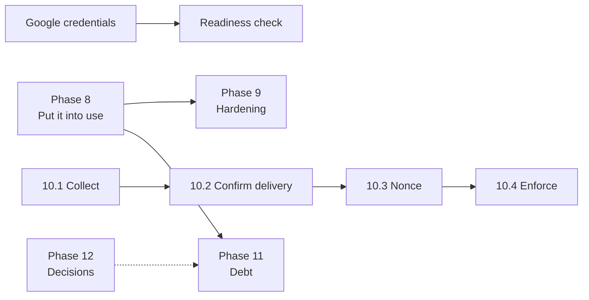

# 06 — Implementation Plan and Status

**Product:** Ethree10 OMS (E310)
**Last updated:** 20 September 2026
**Production:** https://oms.ethree10.com — healthy, deploys green

This is the living status document. Update it in the same session as any phase that lands.

---

## 1. Where the project actually is

**The platform is built. It is not yet being used.**

| Area | State |
|---|---|
| Features | ✅ Complete across intake, delivery, money, reporting |
| Security | ✅ Audited twice, findings closed |
| Tests | ✅ 262 unit + integration + E2E + docs, all green |
| Deploy | ✅ Atomic, gated, green |
| Backups | ⚠️ Running and restore-verified — **all copies on the machine they protect** |
| Observability | ❌ `SENTRY_DSN` unset |
| Google sign-in | ⛔ Blocked on credentials |
| **Operational use** | ❌ **0 tasks in production** |

### Production reality, measured 20 September 2026

```
branches: 2 (both led)     people:   23
requests: 6                projects: 3 active
tasks:    0                invoices: 0      receipts: 0
```

Three projects are active — 41, 37 and 12 days old — and **none has a single task**, so
nobody can be assigned anything. Three of six requests are UNROUTED. All six are unclassified
against a 27-row service catalogue.

> Every remaining engineering task is secondary to this. The delivery chain is
> request → project → task → assignee, and in production it stops at project. One real task,
> assigned to one real person, would prove more than the last ten pull requests.

---

## 2. Completed phases

### Phase 1 — Foundation ✅
Next.js 16 / React 19 / TypeScript, Prisma + PostgreSQL, tRPC, Auth.js with a custom adapter,
shadcn/ui, three route groups.

### Phase 2 — Organisation and RBAC ✅
Eight roles, `Action` union, `ROLE_PERMISSIONS`, named role groups. Branch/Department
hierarchy. Membership lifecycle with soft delete. Workspace/tenant abstraction removed.

### Phase 3 — Intake and delivery ✅
Public request form, 14-stage lifecycle, routing, approval rules, triage by urgency.
Projects, tasks, two-step assignment, templates, deliverables and versions, reviews,
dependencies, time logging.

### Phase 4 — Money governance ✅
Budget approval gate, separation of duties, delegation. Invoices, Paystack, idempotent
receipts, expenses. `verify:governance` (24 assertions) and `check:reconciliation`.

### Phase 5 — Reporting and platform ✅
Weekly reports with PDF export, contributions, amendments, scorecards, KPI snapshots.
Audit log with archival. Notifications (in-app, email, WhatsApp). Attachments via presigned
upload. Plane integration.

### Phase 6 — Operational readiness ✅
Atomic builds, four post-deploy gates, backup automation with restore verification,
diagnostics and ops workflows, readiness checks, dependency ratchet.

### Phase 7 — Security remediation ✅
*Both the internal 41-finding audit and the external QA report.*

| Finding | Resolution |
|---|---|
| Dev-login bypass reachable in production | Gated on `E2E_TEST_AUTH` **and** loopback |
| Spoofable client IP | Last `x-forwarded-for` hop |
| Payment double-confirmation | Conditional `updateMany` claim |
| Receipt cross-invoice leak | Scoped to `invoiceId`; unsafe dedupe removed |
| `scopedDb` scoping reads but not writes | Deleted |
| Template code collisions | Centralised allocator |
| Members could not be reactivated | Invite revives the removed row |
| Three stubbed auth contexts | Replaced with `useAgencyContext()` |
| **Guessable invoice/receipt codes** | CSPRNG, Crockford base32, 60 bits |
| **Four procedures with no authorization** | `timeLogs` ×3 + `attachments.list` |
| Silent sign-in failures | `?error=` read and explained |
| Broken offline page | Real `/offline`, rewritten service worker |
| Inconsistent branding | One wordmark component |
| CSP reporting to nowhere | Endpoint, both wire formats, redaction, read-back workflow |
| Privacy/terms unlinked and silent on Google | Linked; Google section written from the code |

---

## 3. Current phase — Phase 8: put it into use

**This is the only phase that matters right now, and it is not an engineering phase.**

| # | Step | Owner | Status |
|---|---|---|---|
| 8.1 | Route the three UNROUTED requests to a branch | Agency admin | ⬜ |
| 8.2 | Classify all six requests against the service catalogue | Agency admin | ⬜ |
| 8.3 | **Create at least one task on PRJ-2026-0001** | Branch head | ⬜ |
| 8.4 | Propose an assignee; branch head approves | Lead + branch head | ⬜ |
| 8.5 | Assignee logs time and submits completion | Team member | ⬜ |
| 8.6 | Review and accept the deliverable | Reviewer | ⬜ |
| 8.7 | Walk one project through a budget and invoice end to end | CE + Finance | ⬜ |

**Exit criteria:** every active project has ≥1 task; ≥1 task reaches `done`; the money path
has been exercised once against a real invoice.

Verify with `pnpm ops:report` or the **Ops report** workflow.

---

## 4. Blocked

| Item | Blocked on | Ready |
|---|---|---|
| **Google sign-in** | `AUTH_GOOGLE_ID` / `AUTH_GOOGLE_SECRET` in `/srv/ethree10/ethree10/.env`, then `supervisorctl restart ethree10-web` | Consent-screen URLs, error copy, privacy/terms all done |
| **Readiness check for Google** | The credentials existing | Will fail a deploy that ships a dead button |

Consent screen values:

```
Home page:      https://oms.ethree10.com/login
Privacy:        https://oms.ethree10.com/privacy
Terms:          https://oms.ethree10.com/terms
Origin:         https://oms.ethree10.com
Redirect URI:   https://oms.ethree10.com/api/auth/callback/google
```

Scopes requested are `openid`, `email`, `profile` only — non-sensitive, so no verification
review. If the domain is Google Workspace, choose **Internal**.

---

## 5. Next phases

### Phase 9 — Operational hardening
| # | Item | Why | Priority |
|---|---|---|---|
| 9.1 | **Off-site backups** | Every copy is on the machine it protects | **High** |
| 9.2 | **Set `SENTRY_DSN`** | Error boundaries report nowhere | **High** |
| 9.3 | Commit `deploy.sh` to version control | The deploy script cannot be reviewed or restored | High |
| 9.4 | Restrict workflow dispatch, or drop root SSH | 10 of 11 workflows hold root | Medium |

### Phase 10 — CSP enforcement
| # | Item | Gate |
|---|---|---|
| 10.1 | Collect violations under real traffic | Needs ≥20 before conclusions |
| 10.2 | Confirm Chrome delivery | Run **CSP violations** workflow |
| 10.3 | Middleware nonce to drop `script-src 'unsafe-inline'` | After 10.1 |
| 10.4 | Switch to enforced | After 10.3 |

`style-src 'unsafe-inline'` is likely permanent — nonces do not cover style attributes.

### Phase 11 — Debt
| # | Item |
|---|---|
| 11.1 | Rename `Team` → `Branch`, `SubUnit` → `Department` |
| 11.2 | Remove MFA residue (3 columns, throwing router methods) |
| 11.3 | Resolve the `super_admin` dual model |
| 11.4 | Triage 5 Dependabot PRs — Tailwind 4 and BullMQ 6 need review, not merge |
| 11.5 | Accessibility audit: contrast, `prefers-reduced-motion`, screen reader |

### Phase 12 — Decisions needed
Not scheduled; each needs a product call first.

- Client accounts, or stay with bearer-token links?
- Multi-agency, or stay single-tenant? *(Today: a rewrite.)*
- More integrations beyond Plane?
- A formal availability target, and the redundancy to meet it?

---

## 6. Dependencies



Phase 9 items are independent of Phase 8 and can run in parallel — but **Phase 8 is not
blocked by anything**, which is why it is the priority.

---

## 7. How to check status

| Question | Command |
|---|---|
| Is production healthy? | `curl https://oms.ethree10.com/api/health` |
| Is work flowing? | **Ops report** workflow, or `pnpm ops:report` |
| Are backups good? | **Backup diagnostics** / `pnpm check:backups` |
| Would enforcing CSP break things? | **CSP violations** workflow |
| Do the money rules hold? | `pnpm verify:governance` |
| Does everything pass? | `pnpm verify` |

---

## Related documents

- [01-PRD.md](01-PRD.md) · [02-TRD.md](02-TRD.md) · [03-App-Flow.md](03-App-Flow.md) · [04-UI-UX-Design-Brief.md](04-UI-UX-Design-Brief.md) · [05-Backend-Schema.md](05-Backend-Schema.md)
- [remediation-plan.md](remediation-plan.md) · [current-state-audit.md](current-state-audit.md) · [pilot-acceptance.md](pilot-acceptance.md) · [release-management.md](release-management.md)
