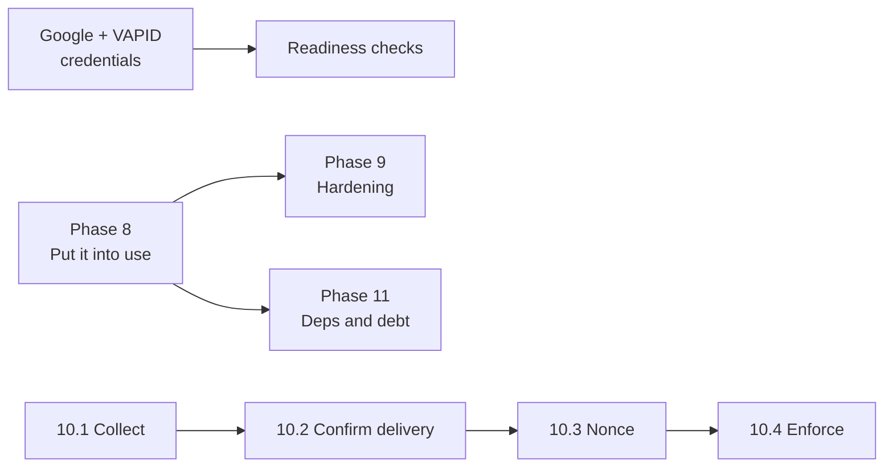

# 06 — Implementation Plan and Status

**Product:** Ethree10 OMS (E310)
**Last updated:** 21 September 2026
**Production:** https://oms.ethree10.com — healthy, last three deploys green

This is the living status document. Update it in the same session as any phase that lands.

---

## 1. Where the project actually is

**The platform carries work now. It carries one piece of work.**

| Area | State |
|---|---|
| Features | ✅ Complete across intake, delivery, money, reporting |
| Security | ✅ Audited twice, findings closed |
| Tests | ✅ 315 across 34 unit files, plus integration, E2E and docs |
| Deploy | ✅ Atomic, gated, green |
| PWA | ✅ Installable, offline, push wired |
| Backups | ⚠️ Running and restore-verified — **all copies on the machine they protect** |
| Observability | ❌ `SENTRY_DSN` unset |
| Google sign-in | ⛔ Blocked on credentials |
| Push notifications | ⛔ Blocked on VAPID keys |
| **Operational use** | ⚠️ **1 task, 2 of 3 projects still empty** |

### Production reality, measured 21 September 2026

```
branches: 2 (both led)     people:   23
requests: 6                projects: 3 active
tasks:    1 (0 unassigned) invoices: 0      receipts: 0
```

The delivery chain reached an assignee for the first time on 21 September:

```
REQ-2026-0002 → PRJ-2026-0002 → TSK-2026-00001 → samuelilelakinwa
```

What is still stalled:

- **3 of 6 requests are UNROUTED** at 13 days — nobody owns them
- **2 of 3 active projects have no tasks** — ERP SOFTWARE at 42 days, and one at 13
- All 6 requests are unclassified against a 27-row service catalogue
- TSK-2026-00001 sits at `todo`; nobody has yet logged time or submitted completion,
  so the second half of the delivery path has still never run

---

## 2. Completed phases

### Phases 1–6 ✅
Foundation, organisation and RBAC, intake and delivery, money governance, reporting and
platform, operational readiness. See the git history; none of it has changed.

### Phase 7 — Security remediation ✅
*Both the internal 41-finding audit and the external QA report.*

| Finding | Resolution |
|---|---|
| Dev-login bypass reachable in production | Gated on `E2E_TEST_AUTH` **and** loopback |
| Spoofable client IP | Last `x-forwarded-for` hop |
| Payment double-confirmation | Conditional `updateMany` claim |
| Receipt cross-invoice leak | Scoped to `invoiceId` |
| `scopedDb` scoping reads but not writes | Deleted |
| Members could not be reactivated | Invite revives the removed row |
| **Guessable invoice/receipt codes** | CSPRNG, Crockford base32, 60 bits |
| **Four procedures with no authorization** | `timeLogs` ×3 + `attachments.list` |
| Silent sign-in failures | `?error=` read and explained |
| Broken offline page | Real `/offline`, rewritten service worker |
| CSP reporting to nowhere | Endpoint, both wire formats, redaction, read-back workflow |
| Privacy/terms unlinked and silent on Google | Linked; Google section written from the code |

### Phase 7b — Product, design and platform ✅
*Shipped 20–21 September.*

| Item | Note |
|---|---|
| Triage offered impossible actions | A request at `in_progress` showed three buttons the server refused. Now derived from one shared transition table. |
| Six core project documents | `01`–`06`, generated from the code |
| **PWA** | Maskable icons, apple-touch-icon, shortcuts, safe-area insets, asset caching. `theme_color` was an indigo belonging to nothing. |
| **Push notifications** | Third channel beside email and WhatsApp, on the `push` preference the schema already had. Retires dead endpoints; handles Chrome's subscription rotation. |
| **Mobile** | Table rows went from ~250px towers to 47px; touch targets 20–36px → 44px; zero horizontal overflow |
| Design pass | Attempted glassmorphism, **reverted at the user's request**. What survives is the legibility work: row dividers 1.31→3.14, muted text 4.17→6.85, button label 4.17→4.74, tabular numerals, lifted navigation rail. |
| `.glass` overrode `.fixed` | A utility set `position: relative` for a decoration, which put **every dialog** into normal flow. Fixed; test asserts the absence. |
| Overscroll | Long pages chained their scroll to the document, which rubber-banded and exposed the canvas. `overscroll-contain` on the scroll containers. |

---

## 3. Current phase — Phase 8: put it into use

**Still the only phase that matters, and still not an engineering phase.**

| # | Step | Owner | Status |
|---|---|---|---|
| 8.1 | Route the three UNROUTED requests to a branch | Agency admin | ⬜ |
| 8.2 | Classify all six requests against the service catalogue | Agency admin | ⬜ |
| 8.3 | Create at least one task on an active project | Branch head | ✅ 21 Sep |
| 8.4 | Assign it | Lead + branch head | ✅ 21 Sep |
| 8.5 | **Assignee logs time and submits completion** | Team member | ⬜ ← next |
| 8.6 | Review and accept the deliverable | Reviewer | ⬜ |
| 8.7 | Walk one project through a budget and invoice end to end | CE + Finance | ⬜ |
| 8.8 | Add tasks to the two projects that still have none | Branch heads | ⬜ |

**Exit criteria:** every active project has ≥1 task; ≥1 task reaches `done`; the money path
has been exercised once against a real invoice.

Verify with the **Ops report** workflow.

### 8a — Organisation structure ✅ partly

Fixed 21 September: Product Design had a task and no members; three departments were led
by someone who was not in them. Every department lead is now a member of the department
they lead.

Outstanding:

- **12 people have no department** — 8 in Digital Media, 4 in Tech & Product
- **Automation & Tools** and **Engineering** have no lead
- `segunayobamidele` is a `department_lead` with no department to lead
- `olayeyeisrael@r4cgloabl.org` holds two Digital Media memberships; unlike
  samuelilelakinwa's, this one has not been shown to be load-bearing

> A lead who is not a member of the department they lead does not see its work in their own
> views, and nothing in the app says so. The **Departments** workflow reports it.

---

## 4. Blocked

| Item | Blocked on |
|---|---|
| **Google sign-in** | `AUTH_GOOGLE_ID` / `AUTH_GOOGLE_SECRET` in `/srv/ethree10/ethree10/.env`, then `supervisorctl restart ethree10-web`. Still returns `error=OAuthSignin`. |
| **Push notifications** | `pnpm exec web-push generate-vapid-keys` → `VAPID_PUBLIC_KEY` / `VAPID_PRIVATE_KEY`, same file. |
| **Readiness checks for both** | The credentials existing. Readiness warns today; it should fail a deploy that ships a dead button. |

Google consent screen values:

```
Home page:      https://oms.ethree10.com/login
Privacy:        https://oms.ethree10.com/privacy
Terms:          https://oms.ethree10.com/terms
Origin:         https://oms.ethree10.com
Redirect URI:   https://oms.ethree10.com/api/auth/callback/google
```

Scopes are `openid`, `email`, `profile` only — non-sensitive, so no verification review. If
the domain is Google Workspace, choose **Internal**.

---

## 5. Next phases

### Phase 9 — Operational hardening
| # | Item | Why | Priority |
|---|---|---|---|
| 9.1 | **Off-site backups** | Every copy is on the machine it protects | **High** |
| 9.2 | **Set `SENTRY_DSN`** | Error boundaries report nowhere | **High** |
| 9.3 | Commit `deploy.sh` to version control | The deploy script cannot be reviewed or restored | High |
| 9.4 | Restrict workflow dispatch, or drop root SSH | **12 of 13** workflows hold root | Medium |

### Phase 10 — CSP enforcement
| # | Item | Gate |
|---|---|---|
| 10.1 | Collect violations under real traffic | Needs ≥20 before the report draws conclusions |
| 10.2 | Confirm Chrome delivery | Run **CSP violations**; still unproven |
| 10.3 | Middleware nonce to drop `script-src 'unsafe-inline'` | After 10.1 |
| 10.4 | Switch to enforced | After 10.3 |

`style-src 'unsafe-inline'` is likely permanent — nonces do not cover style attributes.

### Phase 11 — Dependencies and debt

Five Dependabot PRs are open, and they are **not** equivalent:

| PR | Change | Verdict |
|---|---|---|
| #49 | Actions group, 3 updates | Low risk |
| #51 | lucide-react 0.483 → 1.41 | Low risk; icon names may move |
| #78 | 40 patch/minor updates | Probably fine, but 40 things at once on a live app |
| #52 | **BullMQ 5 → 6** | Touches the worker that sends notifications. Test first. |
| #53 | **Tailwind 3.4 → 4.3** | **Not a merge.** Rewrites the config format and the engine. This session alone hit `min-h-11` not existing and `bg-sidebar/82` not generating — a major bump would churn every surface just measured. |

Other debt:

| # | Item |
|---|---|
| 11.1 | Rename `Team` → `Branch`, `SubUnit` → `Department` |
| 11.2 | Remove MFA residue (3 columns, throwing router methods) |
| 11.3 | Resolve the `super_admin` dual model |
| 11.4 | Accessibility audit: full contrast sweep, screen reader |

### Phase 12 — Decisions needed
Not scheduled; each needs a product call first.

- Client accounts, or stay with bearer-token links?
- Multi-agency, or stay single-tenant? *(Today: a rewrite.)*
- More integrations beyond Plane?
- A formal availability target, and the redundancy to meet it?

---

## 6. Dependencies



Phase 9 is independent of Phase 8 and can run in parallel. **Phase 8 is blocked by nothing**,
which is why it stays the priority.

---

## 7. How to check status

| Question | Command or workflow |
|---|---|
| Is production healthy? | `curl https://oms.ethree10.com/api/health` |
| Is work flowing? | **Ops report** |
| Who is in which department? | **Departments** |
| Who can take a task? | **Assign task** (no `to`/`by` lists candidates) |
| Are backups good? | **Backup diagnostics** |
| Would enforcing CSP break things? | **CSP violations** |
| Do the money rules hold? | `pnpm verify:governance` |
| Does everything pass? | `pnpm verify` |

> Local development runs on **port 3010** (`.claude/launch.json`); port 3000 belongs to
> another project on this machine. `.env.local` still points `NEXTAUTH_URL` at 3000, so
> local sign-in redirects to the wrong app until that is changed.

---

## Related documents

- [01-PRD.md](01-PRD.md) · [02-TRD.md](02-TRD.md) · [03-App-Flow.md](03-App-Flow.md) · [04-UI-UX-Design-Brief.md](04-UI-UX-Design-Brief.md) · [05-Backend-Schema.md](05-Backend-Schema.md)
- [remediation-plan.md](remediation-plan.md) · [current-state-audit.md](current-state-audit.md) · [pilot-acceptance.md](pilot-acceptance.md) · [release-management.md](release-management.md)
